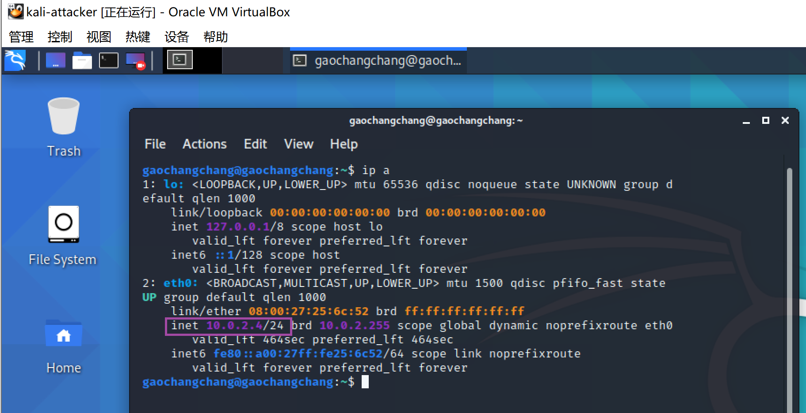
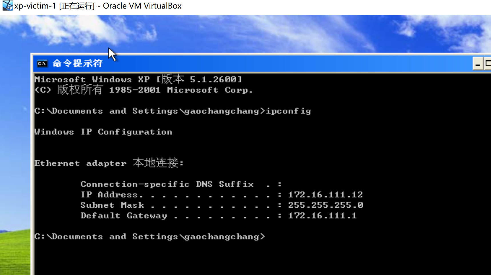
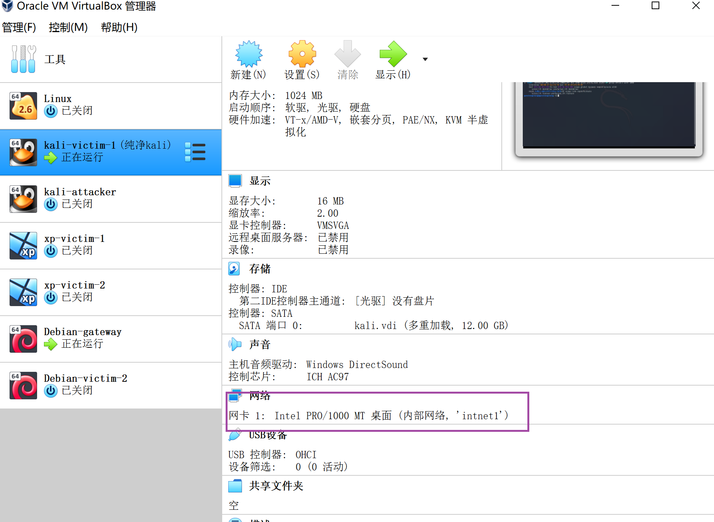
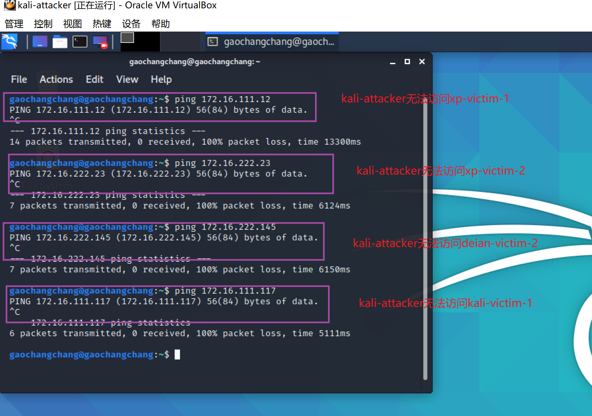

## 实验一：基于 VirtualBox 的网络攻防基础环境搭建

### **实验目的**

- 掌握 VirtualBox 虚拟机的安装与使用
- 掌握 VirtualBox 的虚拟网络类型和按需配置
- 掌握 VirtualBox 的虚拟硬盘多重加载

### **实验环境**

- VirtualBox 虚拟机
- 攻击者主机（Attacker）：Kali Rolling 2020.3
- 网关（Gateway, GW）：Debian Buster
- 靶机（Victim）： xp-sp3 / Kali

### **实验要求**

- [ √ ] 靶机可以直接访问攻击者主机

- [ √ ] 攻击者主机无法直接访问靶机

- [ √ ] 网关可以直接访问攻击者主机和靶机

- [ √ ] 靶机的所有对外上下行流量必须经过网关

- [ √ ] 所有节点均可以访问互联网


### **实验过程**

**1. 虚拟机配置**

- 下载系统镜像
    - kali-linux-2020.3-installer-amd64.iso
    - debian-10.5.0-amd64-netinst.iso
    - zh-hans_windows_xp_professional_with_service_pack_3_x86_cd_vl_x14-74070.iso
    
- 初次安装系统
    - xp 
        - 安装过程几乎全程`下一步`
        - 序列号：dg8fv-b9tky-frt9j-6crcc-xpq4g
        - 不需要开自动更新
    - debian
        - [安装教程](https://phoenixnap.com/kb/how-to-install-debian-10-buster)
        - 选择安装的软件时，只装`OpenSSH Server`和`standard system utilities`
        - GRUB boot loader安装位置：/dev/sda
    - kali
        - 版本选择Oracle(64-bit)

- 多重加载

    管理->虚拟介质管理->把类型改为`多重加载`->释放盘片

    

- 虚拟机配置结果

    - 两台kali：攻击者kali-attacker、靶机kali-victim-1
    - 两台xp：靶机xp-victim-1、靶机xp-victim-2
    - 两台Debian：网关Debian-gateway、靶机Debian-victim-2

    


**2. 网络设置**

所搭建的网络拓扑如下：


2.1 网关配置(Debian-gateway)

四块网卡配置：
- NAT网络：网关可以访问攻击者主机
- Host-Only：方便使用ssh
- 两块内部网络：搭建两个独立的局域网intnet1和intnet2


```bash
#用户切换
su

#修改配置文件
vi /etc/network/interfaces

#重启
/sbin/ifup enp0s9
/sbin/ifup enp0s10
sudo systemctl restart networking

#安装dnsmasq
apt-get update  
apt-get install dnsmasq 

#修改/etc/dnsmasq.d/gw-enp09.conf
interface=enp0s9
dhcp-range=172.16.111.10,172.16.111.150,240h


#修改/etc/dnsmasq.d/gw-enp10.conf
interface=enp0s10
dhcp-range=172.16.222.10,172.16.222.150,240h

#备份dnsmasq.conf文件
cp dnsmasq.conf dnsmasq.conf.bak

#修改dnsmasq.conf文件
#log-dhcp--->log-dhcp
#log-queries--->log-queries
#在log-queries下面加一条命令
log-facility=/var/log/dnsmasq.log

#重启dnsmasq
/etc/init.d/dnsmasq restart
```
[修改/etc/network/interfaces
文件方法](https://gist.github.com/c4pr1c3/8d1a4550aa550fabcbfb33fad9718db1)


执行`ip a`结果如下


2.2 攻击者配置(kali-attacker)

网卡：
- NAT网络




2.3 四个靶机配置

2.3.1 xp-victim-1

网卡：
- 内部网络，intnet1


ip地址(172.16.111.12)为手动指定, 另关闭防火墙（为了网关能访问xp靶机）



2.3.2 xp-victim-2

网卡：
- 内部网络，intnet2


ip地址(172.16.222.23)为手动指定, 另关闭防火墙


2.3.3 kali-victim-1


网卡：
- 内部网络，intnet1




2.3.4 debian-victim-2


网卡：
- 内部网络，intnet2


至此归纳各个系统的ip地址


| id       | ip address   |
| ---    | --- |
| Debian-gateway   | 10.0.2.15/24 |
|           |   192.168.56.101/24   |
|        |  172.16.111.1/24    |
|        |  172.16.222.1/24    |
|    kali-attacker    | 10.0.2.4/24   |
| xp-victim-1|172.16.111.12/24|
| xp-victim-2|172.16.222.23/24|
| kali-victim-1|172.16.111.117/24|
| debian-victim-2|172.16.222.145/24|


### **网络连通性测试**


#### **1. 靶机可以直接访问攻击者主机**


kali-victim-1访问kali-attacker


Debian-victim-2访问kali-attacker


xp-victim-1访问kali-attacker


xp-victim-2访问kali-attacker


#### **2. 攻击者主机无法直接访问靶机**





#### **3. 网关可以直接访问攻击者主机和靶机**


#### **4.靶机的所有对外上下行流量必须经过网关**

```bash
apt update
apt install tmux
apt install tcpdump
/sbin/tcpdump -i enp0s10 -n -w 20200923.1.pcap
```

xp-victim-1对外上下行流量要经过网关Debian-gateway


xp-victim-2对外上下行流量要经过网关Debian-gateway


kali-victim-1对外上下行流量要经过网关Debian-gateway


Debian-victim-2对外上下行流量要经过网关Debian-gateway


#### **5.所有节点均可以访问互联网**

Debian-gateway可以访问互联网


kali-attacker可以访问互联网


xp-victim-1可以访问互联网


xp-victim-2可以访问互联网


kali-victim-1访问互联网


debian-victim-2访问互联网


### **遇到的问题与解决办法**

- 网关出现域名无法解析的报错

   -   解决：更改`/etc/resolv.conf`文件，将原来的`nameserver 202.205.16.4`注释掉，添加`nameserver 114.114.114.114`

- 在下载了tcpdump之后显示`tcpdump: command not found`
    - 解决：将tcpdump改成`/sbin/tcpdump`即可

### **参考资料**

[老师的视频](https://www.bilibili.com/video/BV16t4y1i7rz?p=12)

[Debian域名解析失败](https://blog.csdn.net/qq_39483108/article/details/90247367)

[师姐的实验报告](https://github.com/CUCCS/2019-NS-Public-YanhuiJessica/tree/ns0x01/ns-0x01)