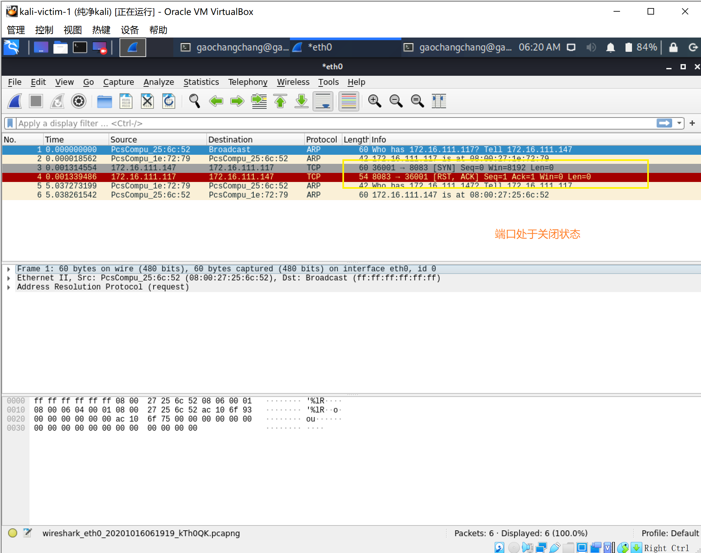
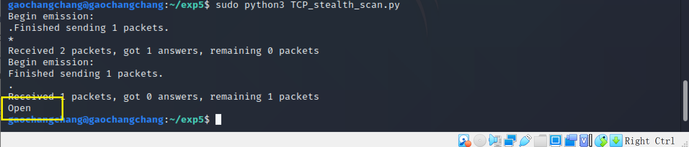
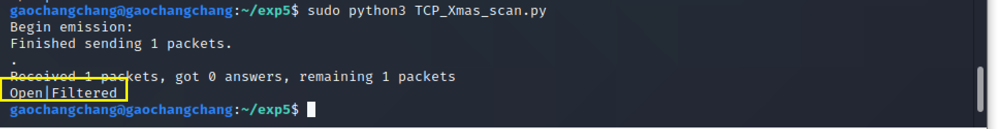
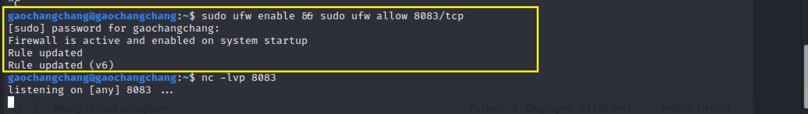
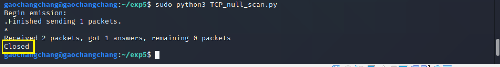
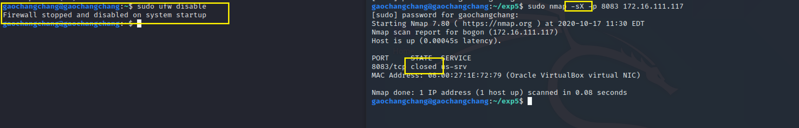

## 实验五：基于 Scapy 编写端口扫描器

### **实验目的**

掌握网络扫描之端口状态探测的基本原理

### **实验环境**
- python 3.8.4
-  [scapy](https://scapy.net/) 2.4.3
- nmap 7.80

### **网络拓扑**


### **实验要求**

- [x] 完成以下扫描技术的编程实现
    - [x] TCP connect scan / TCP stealth scan
    - [x] TCP Xmas scan / TCP fin scan / TCP null scan
    - [x] UDP scan
- [x] 上述每种扫描技术的实现测试均需要测试端口状态为：开放、关闭 和 过滤 状态时的程序执行结果
- [x] 提供每一次扫描测试的抓包结果并分析与课本中的扫描方法原理是否相符？如果不同，试分析原因；
- [x] 在实验报告中详细说明实验网络环境拓扑、被测试 IP 的端口状态是如何模拟的
- [x] （可选）复刻 nmap 的上述扫描技术实现的命令行参数开关

### **实验先述知识**

- 端口状态
    - 开放✅
    - 关闭⛔
    - 被过滤⚠
- 控制端口状态
    ```bash
    #安装ufw
    sudo apt install ufw
    #允许端口访问
    sudo ufw enable && ufw allow portno/tcp(udp)
    #端口过滤状态
    sudo ufw enable && ufw deny portno/tcp(udp)
    #端口关闭状态
    sudo ufw disable
    ```


### **实验过程**

**1. TCP connect scan**

**实验预期**

首先发送一个 SYN 数据包到目标主机的特定端口上，接着我们可以通过接收包的情况对端口的状态进行判断：如果接收到的是一个 SYN/ACK 数据包，则说明端口是开放状态的；如果接收到的是一个 RST/ACK 数据包，通常意味着端口是关闭的并且链接将会被重置；而如果目标主机没有任何响应则意味着目标主机的端口处于过滤状态。

**代码**

[tcp_connect_scan.py](code/tcp_connect_scan.py)

**实验结果**

**closed**

kali-victim-1


kali-attacker


观察抓包结果



分析：接收到的是RST/ACK数据包，证明端口处于关闭状态⛔，与预期相符

**filtered**

kali-victim-1


kali-attacker


观察抓包结果


分析：只收到了一个TCP包，靶机没有响应，证明端口处于过滤状态⚠，与预期相符


**open**

kali-victim-1


kali-attacker


观察抓包结果


分析：接收到的是SYN/ACK数据包，证明端口处于开启状态✅，与预期相符

**2.TCP stealth  scan**

**实验预期**

与TCP connect scan扫描相似

**代码**

[TCP_stealth_scan.py](code/TCP_stealth_scan.py)


**实验结果**


**closed**


kali-victim-1


kali-attacker


观察抓包结果


分析：接收到的是RST/ACK数据包，证明端口处于关闭状态⛔，与预期相符

**filtered**

kali-victim-1


kali-attacker


观察抓包结果


分析：只收到了一个SYN包，靶机没有响应，证明端口处于过滤状态⚠，与预期相符

**open**

kali-victim-1


kali-attacker



观察抓包结果


分析：接收到的是SYN/ACK数据包，证明端口处于开启状态✅，与预期相符

**3.TCP Xmas scan**

**实验预期**

Xmas 发送一个 TCP 包，并对 TCP 报文头 FIN、URG 和 PUSH 标记进行设置。若是关闭的端口则响应 RST 报文；开放或过滤状态下的端口则无任何响应。

**代码**

[TCP_Xmas_scan.py](code/TCP_Xmas_scan.py)


**实验结果**


**closed**

kali-victim-1


kali-attacker


观察抓包结果


分析：接收到的是RST数据包，证明端口处于关闭状态⛔，与预期相符


**filtered**

kali-victim-1


kali-attacker


观察抓包结果


分析：Xmas 发送一个 TCP 包，并对 TCP 报文头 FIN、URG 和 PUSH 标记进行设置；只收到了一个TCP包，且靶机没有响应，证明端口处于过滤状态⚠，与预期相符

**open**

kali-victim-1


kali-attacker



观察抓包结果


分析：只收到了一个TCP包，且靶机没有响应，证明端口处于开启状态✅，与预期相符

**4.TCP fin scan**

**实验预期**

仅发送 FIN 包，它可以直接通过防火墙，如果端口是关闭的就会回复一个 RST 包，如果端口是开放或过滤状态则对 FIN 包没有任何响应。

**代码**

[TCP_fin_scan.py](code/TCP_fin_scan.py)


**实验结果**

**closed** 

kali-victim-1


kali-attacker


观察抓包结果


分析：接收到的是RST数据包，证明端口处于关闭状态⛔，与预期相符


**filtered**

kali-victim-1


kali-attacker


观察抓包结果


分析：只收到了一个TCP包，且靶机没有响应，证明端口处于过滤状态⚠，与预期相符

**open**

kali-victim-1



kali-attacker


观察抓包结果


分析：只收到了一个TCP包，且靶机没有响应，证明端口处于开启状态✅，与预期相符

**5.TCP null scan**

**实验预期**

发送一个 TCP 数据包，关闭所有 TCP 报文头标记。只有关闭的端口会发送 RST 响应。

**代码**

[TCP_null_scan.py](code/TCP_null_scan.py)


**实验结果**


**closed**

kali-victim-1


kali-attacker



观察抓包结果


分析：接收到的是RST数据包，证明端口处于关闭状态⛔，与预期相符

**filtered**

kali-victim-1


kali-attacker


观察抓包结果


分析：只收到了一个TCP包，且靶机没有响应，证明端口处于过滤状态⚠，与预期相符

**open**

kali-victim-1


kali-attacker


观察抓包结果


分析：只收到了一个TCP包，且靶机没有响应，证明端口处于开启状态✅，与预期相符

**6.UDP scan**

**实验预期**

大多数 UDP 端口扫描的方法就是向各个被扫描的 UDP 端口发送零字节的 UDP 数据包，如果收到一个 ICMP 不可到达的回应，那么则认为这个端口是关闭的,对于没有回应的端口则认为是开放的，但是如果目标主机安装有防火墙或其它可以过滤数据包的软硬件,那我们发出 UDP 数据包后,将可能得不到任何回应,我们将会见到所有的被扫描端口都是开放的。

**代码**

[UDP_scan.py](code/UDP_scan.py)


**实验结果**

**closed**

kali-victim-1


kali-attacker


观察抓包结果


分析：收到了一个 ICMP 不可到达的回应，证明端口处于关闭状态⛔，与预期相符

**filtered**

kali-victim-1


kali-attacker


观察抓包结果


分析：只收到了一个UDP包，且靶机没有响应，证明端口处于过滤状态⚠，与预期相符

**open**

kali-victim-1


kali-attacker


观察抓包结果


分析：只收到了一个UDP包，且靶机没有响应，证明端口处于开启状态✅，与预期相符

**7.使用nmap扫描复刻**

1.TCP connect scan

**closed**


**filtered**


**open**


2.TCP stealth scan


**closed**


**filtered**


**open**


3.TCP Xmas scan


**closed**




**filtered**


**open**


4.TCP FIN scan

**closed**


**filtered**


**open**


5.TCP NULL scan


**closed**


**filtered**


**open**


6.UDP scan

**closed**


**filtered**


**open**


### **问题与解决方法**

- 在nmap复刻TCP connect scan中的开启状态时，无法正常开启
    - 解决：执行`python3 -m http.server 8083`
- 无法打开UDP端口
    - 解决：打开dnsmasq，执行`systemctl start dnsmasq`


### **参考资料**


[师姐的作业](https://github.com/CUCCS/2019-NS-Public-chencwx/blob/ns_chap0x05/ns_chapter5/%E7%BD%91%E7%BB%9C%E6%89%AB%E6%8F%8F%E5%AE%9E%E9%AA%8C%E6%8A%A5%E5%91%8A.md)

[老师的课本](https://c4pr1c3.github.io/cuc-ns/chap0x05/main.html)

[port-scanning-using-scapy](https://resources.infosecinstitute.com/port-scanning-using-scapy/)