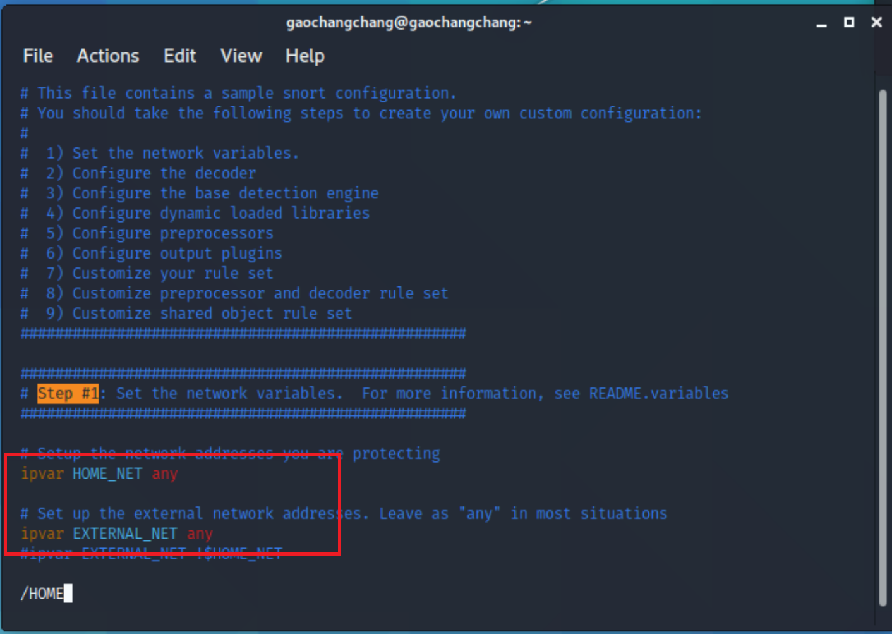

# 入侵检测

## 实验要求

- 利用snort以及suricata实现入侵检测

## 实验环境

- Snort  2.9.7.0 

- suricata 5.0.0


#### **网络拓扑**


**网络连通性测试**


## 实验环境配置

```bash
# 禁止在apt安装时弹出交互式配置界面
export DEBIAN_FRONTEND=noninteractive

apt install snort
```

## 实验过程


### 实验一：配置snort为嗅探模式

```bash
# 显示IP/TCP/UDP/ICMP头
snort -v
```


```bash
# 显示应用层数据
snort -vd
```

一些UDP头


以及一些ICMP头


```bash
# 显示数据链路层报文头
snort -vde
```


```bash
# -b 参数表示报文存储格式为 tcpdump 格式文件
# -q 静默操作，不显示版本欢迎信息和初始化信息
snort -q -v -b -i eth0 "port not 22"

# 使用 CTRL-C 退出嗅探模式
# 嗅探到的数据包会保存在 /var/log/snort/snort.log.<epoch timestamp>
# 其中<epoch timestamp>为抓包开始时间的UNIX Epoch Time格式串
# 可以通过命令 date -d @<epoch timestamp> 转换时间为人类可读格式
# exampel: date -d @1511870195 转换时间为人类可读格式
# 上述命令用tshark等价实现如下：
tshark -i eth0 -f "port not 22" -w 1_tshark.pcap
```

查看嗅探结果


### 实验二：配置并启用snort内置规则

```bash
# /etc/snort/snort.conf 中的 HOME_NET 和 EXTERNAL_NET 需要正确定义
# 例如，学习实验目的，可以将上述两个变量值均设置为 any
```



```bash

snort -q -A console -b -i eth0 -c /etc/snort/snort.conf -l /var/log/snort/

```


### 实验三：自定义snort规则


```
# 新建自定义 snort 规则文件
cat << EOF > /etc/snort/rules/cnss.rules
alert tcp \$EXTERNAL_NET any -> \$HTTP_SERVERS 80 (msg:"Access Violation has been detected on /etc/passwd ";flags: A+; content:"/etc/passwd"; nocase;sid:1000001; rev:1;)
alert tcp \$EXTERNAL_NET any -> \$HTTP_SERVERS 80 (msg:"Possible too many connections toward my http server"; threshold:type threshold, track by_src, count 100, seconds 2; classtype:attempted-dos; sid:1000002; rev:1;)
EOF
```


**PS:规则解析**

>alert tcp \$EXTERNAL_NET any -> \$HTTP_SERVERS 80 (msg:"Possible too many connections toward my http server"; threshold:type threshold, track by_src, count 100, seconds 2; classtype:attempted-dos; sid:1000002; rev:1;)

参考教材中的图片


告警规则，从源IP为 \$EXTERNAL_NET任意端口发送tcp包到目标IP为\$HTTP_SERVERS的80端口

发送信息为`Possible too many connections toward my http server`

Threshold采用阈值法，每2s产生100次警告

classtype，规则类别表示，把告警划分为dos攻击

sid，snort规则id；rev，规则版本号


```
# 添加配置代码到 /etc/snort/snort.conf
include $RULE_PATH/cnss.rules
```


```
snort -q -A fast -b -i eth0 -c /etc/snort/snort.conf -l /var/log/snort/
```


### 实验四：和防火墙联动


```

#获取guardian压缩包
wget https://c4pr1c3.github.io/cuc-ns/chap0x09/attach/guardian.tar.gz

#解压缩 Guardian-1.7.tar.gz
tar zxf guardian.tar.gz

#安装 Guardian 的依赖 lib
apt install libperl4-corelibs-perl

#在kali-victim中开启 snort
snort -q -A fast -b -i eth0 -c /etc/snort/snort.conf -l /var/log/snort/

#编辑 guardian.conf 并保存
#修改内容
HostIpAddr      172.16.111.38
Interface       eth0
```


```
#启动 guardian.pl
perl guardian.pl -c guardian.conf
```


用attacker进行nmap扫描


查看扫描结果


查看iptables，guardian.conf 中默认的来源IP被屏蔽时间是 60 秒（屏蔽期间如果黑名单上的来源IP再次触发snort报警消息，则屏蔽时间会继续累加60秒）


## 实验思考题

**1.IDS与防火墙的联动防御方式相比IPS方式防御存在哪些缺陷？是否存在相比较而言的优势？**

IDS: 入侵检测系统，分析和监视网络流量，将当前的网络活动与已知的威胁数据库进行比较，以检测入侵行为，检测代表着不会主动修改数据包

IPS：入侵防御系统，与防火墙位于同一网络区域，防御意味着会根据包的内容主动阻止包的传递

**缺陷**：IDS即使检测到了入侵行为，也无法主动拦截防御

**优势**：当IDS误报时，只会引起警报；当IPS误报时，会引起重要数据包的丢失

2.使用 suricata 代替 Snort ，重复本实验

3.配置 suricata 为 IPS 模式，重复 `实验四`

**说明😀：**

kali-victim的IP地址由172.16.111.38变为172.16.111.39，其他IP地址均不变

**实验一：配置 suricata 为嗅探模式**

```bash
#更新
apt-get update

#安装依赖
apt-get install libpcre3-dbg libpcre3-dev autoconf automake libtool libpcap-dev libnet1-dev libyaml-dev zlib1g-dev libcap-ng-dev libmagic-dev libjansson-dev libjansson4
apt-get install libnetfilter-queue-dev libnetfilter-queue1 libnfnetlink-dev

#获取压缩包
 wget http://www.openinfosecfoundation.org/download/suricata-5.0.0.tar.gz

#解压
tar xzf suricata-5.0.0.tar.gz

#查看当前目录文件夹
cd suricata-5.0.0/
ls
```


```bash
#配置并安装
./configure --enable-nfqueue --prefix=/usr --sysconfdir=/etc --localstatedir=/var
make
make install
make install-rules

#查看版本
suricata -V
```


```bash
#开启监听eth0
suricata -c /etc/suricata/suricata.yaml -i eth0

#查看日志
#日志保存在/var/log/suricata/目录下
cd /var/log/suricata/
ls -l
#fast.log是报警日志文件
```


**实验二：配置并启用suricata内置规则**

查看`/etc/suricata/suricata.yaml`文件中`HOME_NET`和`EXTERNAL_NET`


```bash
#suricata的内置规则在/var/lib/suricata/rules/下
cd /var/lib/suricata/rules/
ls -l
```


```bash
#在kali-victim主机上开启监听
suricata -c /etc/suricata/suricata.yaml -i eth0

#在kali-attacker主机上扫描
nmap 172.16.111.39 -A -T4 -n -vv
```

查看扫描结果


**实验三：自定义suricata规则**

```
#新建自定义suricata规则文件
vim /var/lib/suricata/rules/test.rules
#修改内容如下
alert tcp any any -> any 80 (msg:"Possible too many connections toward my http server"; threshold:type threshold, track by_src, count 100, seconds 2; classtype:attempted-dos; sid:1000002; rev:1;)

```


```bash
#添加配置代码到 /etc/suricata/suricata.yaml
vim /etc/suricata/suricata.yaml

#修改内容
rule-files:
	- test.rules
	
suricata -v -c /etc/suricata/suricata.yaml -i eth0	
```


**实验四：和防火墙联动**（未完成）

```bash
#在kali-victim中开启suricata
suricata -v -c /etc/suricata/suricata.yaml -i eth0	

#编辑 guardian.conf 并保存
#修改内容
HostIpAddr      172.16.111.39
Interface       eth0

#启动 guardian.pl
perl guardian.pl -c guardian.conf

#在kali-attacker上执行命令
ab -n 1000  http://172.16.111.39/test
```


在通过攻击者进行压力测试时，guardian没有任何反应，通过查看iptables，攻击者也并没有被添加到黑名单中，未解决T T


**配置 Suricata 为 IPS 模式**


```bash
#配置iptables
sudo iptables -I INPUT -j NFQUEUE
sudo iptables -I OUTPUT -j NFQUEUE

#添加规则到/var/lib/suricata/rules/suricata.rules
alert tcp any any -> any any (msg:"Test ab"; threshold:type threshold, track by_src, count 100, seconds 2; classtype:attempted-dos; sid:1000002; rev:1;)


#启用 NFQ 模式
sudo suricata -v -c /etc/suricata/suricata.yaml -q 0
```


```bash
#查看统计信息
sudo iptables -vnL
```


## 遇到的问题和解决方法

1.kali无法安装snort

解决：修改/etc/apt/sources.list为
```
deb http://http.kali.org/kali kali-rolling main contrib non-free
# For source package access, uncomment the following line
# deb-src http://http.kali.org/kali kali-rolling main contrib non-free
deb http://http.kali.org/kali sana main non-free contrib
deb http://security.kali.org/kali-security sana/updates main contrib non-free
# For source package access, uncomment the following line
# deb-src http://http.kali.org/kali sana main non-free contrib
# deb-src http://security.kali.org/kali-security sana/updates main contrib non-free
deb http://old.kali.org/kali moto main non-free contrib
# For source package access, uncomment the following line
# deb-src http://old.kali.org/kali moto main non-free contrib
```

2.tshark报错


解决：更换到了家目录下，再执行即可

3.攻击者主机在对victim进行压力测试`ab -n 200 http://172.16.111.38/`时，无法建立连接，显示

`apr_socket_recv: connection refused (111)`


解决：网络故障层层排查，attacker和victim之间可以相互ping通，但是执行`curl http://172.16.111.38/`时报错`curl: (7) Failed to connect to 172.16.111.38 port 80: Connection refused`

用nmap扫描发现是victim的80端口没开


通过apache将80端口打开就好啦


4.使用suricata和防火墙联动（实验四）未解决，蹲一个解决方法


## 参考文献

[2018-NS-Public-jckling](https://github.com/CUCCS/2018-NS-Public-jckling/blob/master/ns-0x09/IDS%26IPS实验报告.md)

[2019-NS-Public-chencwx](https://github.com/CUCCS/2019-NS-Public-chencwx/blob/ns_chap0x09/ns_chapter9/%E5%85%A5%E4%BE%B5%E6%A3%80%E6%B5%8B.md)

[课本第九章](https://c4pr1c3.github.io/cuc-ns/chap0x09/exp.html)

[how-to-solve-kali-linux-apt-get-install-e-unable-to-locate-package-checkinstall](https://ourcodeworld.com/articles/read/961/how-to-solve-kali-linux-apt-get-install-e-unable-to-locate-package-checkinstall)


[ab testing - apr_socket_recv: Connection refused (111)](https://www.apachelounge.com/viewtopic.php?t=6021)

[install-suricata](https://www.unixmen.com/install-suricata-ids-on-ubuntu-16-04/)

[Suricata User Guide Release 5.0.0-dev](https://suricata.readthedocs.io/_/downloads/en/suricata-5.0.0-beta1/pdf/)

[Suricata rules](https://suricata.readthedocs.io/en/suricata-5.0.0/rules/intro.html)

[Suricata规则介绍](https://zhuanlan.zhihu.com/p/36340468)


