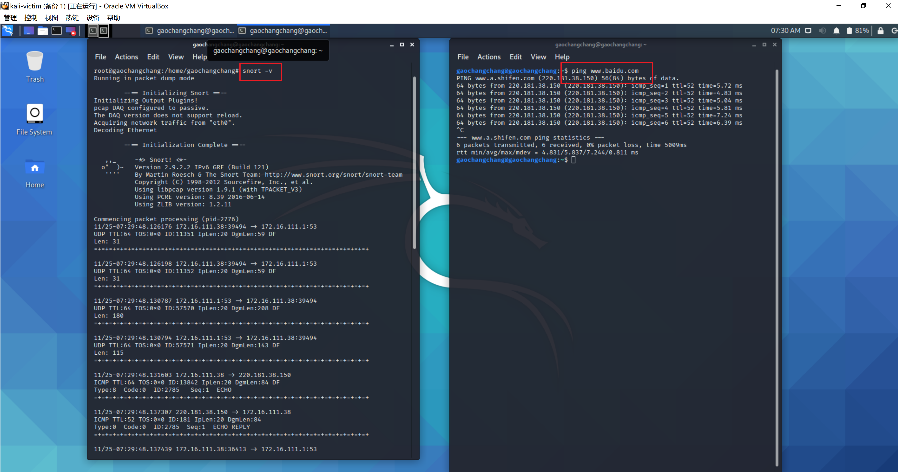
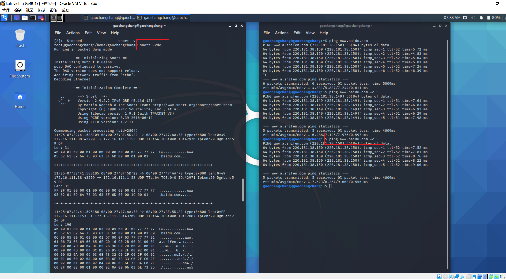
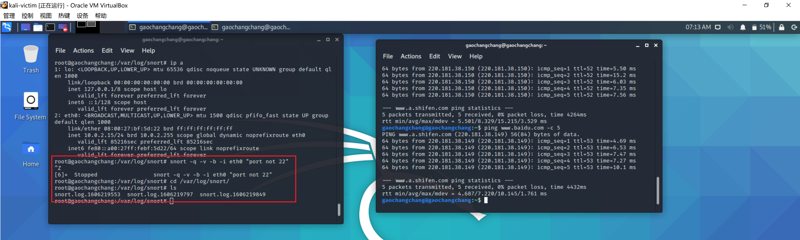

# 入侵检测


## **实验环境配置**
```bash
# 禁止在apt安装时弹出交互式配置界面
export DEBIAN_FRONTEND=noninteractive

apt install snort
```
## **实验过程**

### 实验一：配置snort为嗅探模式


```bash
# 显示IP/TCP/UDP/ICMP头
snort –v
```



```bash
# 显示应用层数据
snort -vd
```


```bash
# 显示数据链路层报文头
snort -vde
```



```bash
# -b 参数表示报文存储格式为 tcpdump 格式文件
# -q 静默操作，不显示版本欢迎信息和初始化信息
/sbin/snort -q -v -b -i enp0s3 "port not 22"

```


查看嗅探结果



```bash
# 使用 CTRL-C 退出嗅探模式
# 嗅探到的数据包会保存在 /var/log/snort/snort.log.<epoch timestamp>
# 其中<epoch timestamp>为抓包开始时间的UNIX Epoch Time格式串
# 可以通过命令 date -d @<epoch timestamp> 转换时间为人类可读格式
# exampel: date -d @1511870195 转换时间为人类可读格式
# 上述命令用tshark等价实现如下：

tshark -i enp0s3 -f "port not 22" -w 1_tshark.pcap
```


[1_tshark.pcap](./1_tshark.pcap)!!!！！!!!!!!改一下


### 实验二：配置并启用snort内置规则


```
# /etc/snort/snort.conf 中的 HOME_NET 和 EXTERNAL_NET 需要正确定义
# 例如，学习实验目的，可以将上述两个变量值均设置为 any
/sbin/snort -q -A console -b -i eth1 -c /etc/snort/snort.conf -l /var/log/snort/
```


启动内置规则


### 实验三：自定义snort规则

```
# 新建自定义 snort 规则文件
cat << EOF > /etc/snort/rules/cnss.rules
alert tcp \$EXTERNAL_NET any -> \$HTTP_SERVERS 80 (msg:"Access Violation has been detected on /etc/passwd ";flags: A+; content:"/etc/passwd"; nocase;sid:1000001; rev:1;)
alert tcp \$EXTERNAL_NET any -> \$HTTP_SERVERS 80 (msg:"Possible too many connections toward my http server"; threshold:type threshold, track by_src, count 100, seconds 2; classtype:attempted-dos; sid:1000002; rev:1;)
EOF
```


### 实验四：和防火墙联动

```
wget https://c4pr1c3.github.io/cuc-ns/chap0x09/attach/guardian.tar.gz


# 解压缩 Guardian-1.7.tar.gz
tar zxf guardian.tar.gz

# 安装 Guardian 的依赖 lib
apt install libperl4-corelibs-perl

```


启动guardian.pl


# 遇到的问题及解决方法

1.root用户编辑后的1_tshark.pcap文件权限为rw-------

解决：粗鲁的修改权限` sudo chmod 777 1_tshark.pcap`

2.putty无法使用粘贴，右键进入VISUAL模式

解决：普通模式下输入`:set mouse-=a`