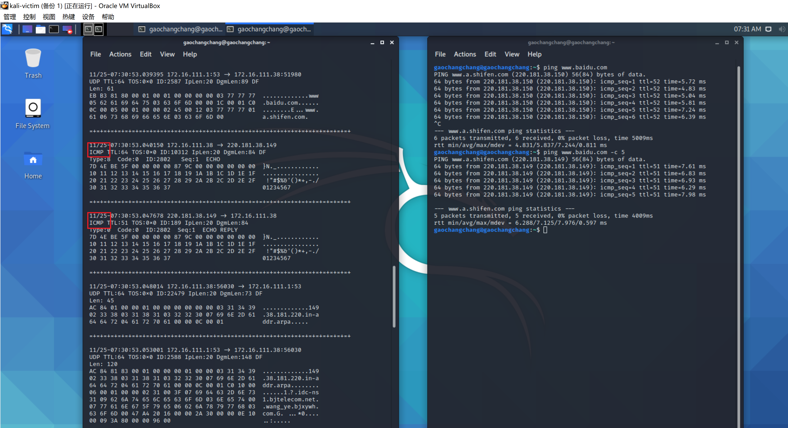
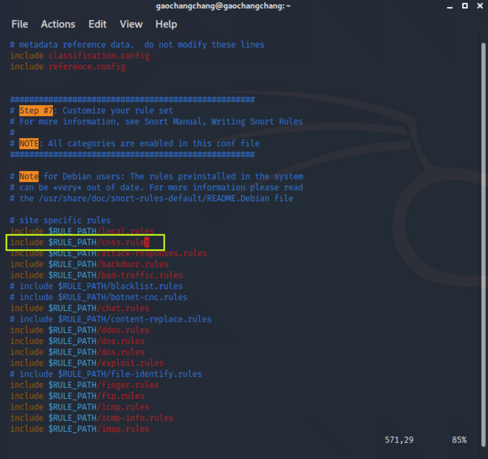
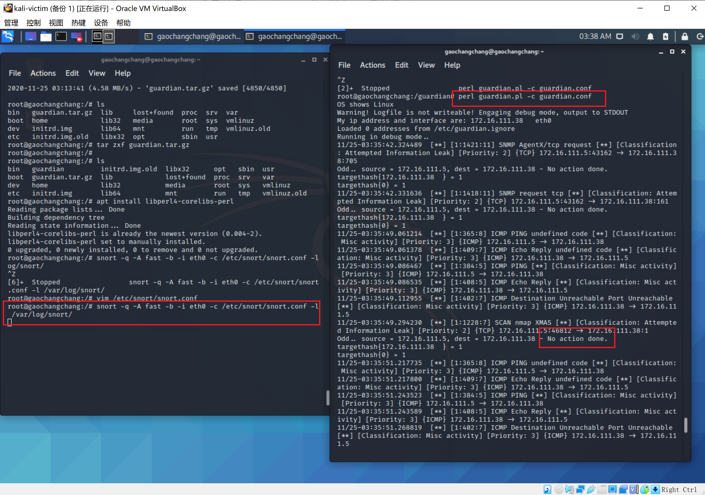

# 入侵检测


## 实验环境

- Snort  2.9.7.0 


## 实验环境配置
```bash
# 禁止在apt安装时弹出交互式配置界面
export DEBIAN_FRONTEND=noninteractive

apt install snort
```

## 实验过程


### 实验一：配置snort为嗅探模式

```bash
# 显示IP/TCP/UDP/ICMP头
snort -v
```


```bash
# 显示应用层数据
snort -vd
```

一些UDP头


以及一些ICMP头



```bash
# 显示数据链路层报文头
snort -vde
```


```bash
# -b 参数表示报文存储格式为 tcpdump 格式文件
# -q 静默操作，不显示版本欢迎信息和初始化信息
snort -q -v -b -i eth0 "port not 22"

# 使用 CTRL-C 退出嗅探模式
# 嗅探到的数据包会保存在 /var/log/snort/snort.log.<epoch timestamp>
# 其中<epoch timestamp>为抓包开始时间的UNIX Epoch Time格式串
# 可以通过命令 date -d @<epoch timestamp> 转换时间为人类可读格式
# exampel: date -d @1511870195 转换时间为人类可读格式
# 上述命令用tshark等价实现如下：
tshark -i eth0 -f "port not 22" -w 1_tshark.pcap
```

查看嗅探结果


### 实验二：配置并启用snort内置规则

```bash
# /etc/snort/snort.conf 中的 HOME_NET 和 EXTERNAL_NET 需要正确定义
# 例如，学习实验目的，可以将上述两个变量值均设置为 any
```


```bash

snort -q -A console -b -i eth0 -c /etc/snort/snort.conf -l /var/log/snort/

```


### 实验三：自定义snort规则


```
# 新建自定义 snort 规则文件
cat << EOF > /etc/snort/rules/cnss.rules
alert tcp \$EXTERNAL_NET any -> \$HTTP_SERVERS 80 (msg:"Access Violation has been detected on /etc/passwd ";flags: A+; content:"/etc/passwd"; nocase;sid:1000001; rev:1;)
alert tcp \$EXTERNAL_NET any -> \$HTTP_SERVERS 80 (msg:"Possible too many connections toward my http server"; threshold:type threshold, track by_src, count 100, seconds 2; classtype:attempted-dos; sid:1000002; rev:1;)
EOF
```


**PS:规则解析**

>alert tcp \$EXTERNAL_NET any -> \$HTTP_SERVERS 80 (msg:"Possible too many connections toward my http server"; threshold:type threshold, track by_src, count 100, seconds 2; classtype:attempted-dos; sid:1000002; rev:1;)


```
# 添加配置代码到 /etc/snort/snort.conf
include $RULE_PATH/cnss.rules
```



```
snort -q -A fast -b -i eth0 -c /etc/snort/snort.conf -l /var/log/snort/
```


### 实验四：和防火墙联动


```

# 获取guardian压缩包
wget https://c4pr1c3.github.io/cuc-ns/chap0x09/attach/guardian.tar.gz

# 解压缩 Guardian-1.7.tar.gz
tar zxf guardian.tar.gz

# 安装 Guardian 的依赖 lib
apt install libperl4-corelibs-perl

# 在kali-victim中开启 snort
snort -q -A fast -b -i eth0 -c /etc/snort/snort.conf -l /var/log/snort/

#编辑 guardian.conf 并保存
#修改内容
HostIpAddr      172.16.111.38
Interface       eth0
```


```
# 启动 guardian.pl
perl guardian.pl -c guardian.conf
```


用attacker进行nmap扫描


查看扫描结果




查看iptables，guardian.conf 中默认的来源IP被屏蔽时间是 60 秒（屏蔽期间如果黑名单上的来源IP再次触发snort报警消息，则屏蔽时间会继续累加60秒）


## 遇到的问题和解决方法

1.kali无法安装snort

解决：修改/etc/apt/sources.list为
```
deb http://http.kali.org/kali kali-rolling main contrib non-free
# For source package access, uncomment the following line
# deb-src http://http.kali.org/kali kali-rolling main contrib non-free
deb http://http.kali.org/kali sana main non-free contrib
deb http://security.kali.org/kali-security sana/updates main contrib non-free
# For source package access, uncomment the following line
# deb-src http://http.kali.org/kali sana main non-free contrib
# deb-src http://security.kali.org/kali-security sana/updates main contrib non-free
deb http://old.kali.org/kali moto main non-free contrib
# For source package access, uncomment the following line
# deb-src http://old.kali.org/kali moto main non-free contrib
```

2.tshark报错


解决：更换到了家目录下，再执行即可

3.攻击者主机在对victim进行压力测试`ab -n 200 http://172.16.111.38/`时，无法建立连接，显示

`apr_socket_recv: connection refused (111)`


解决：网络故障层层排查，attacker和victim之间可以相互ping通，但是执行`curl http://172.16.111.38/`时报错`curl: (7) Failed to connect to 172.16.111.38 port 80: Connection refused`

用nmap扫描发现是victim的80端口没开


通过apache将80端口打开就好啦


## 参考文献


[2019-NS-Public-chencwx](https://github.com/CUCCS/2019-NS-Public-chencwx/blob/ns_chap0x09/ns_chapter9/%E5%85%A5%E4%BE%B5%E6%A3%80%E6%B5%8B.md)

[课本第九章](https://c4pr1c3.github.io/cuc-ns/chap0x09/exp.html)

[how-to-solve-kali-linux-apt-get-install-e-unable-to-locate-package-checkinstall](https://ourcodeworld.com/articles/read/961/how-to-solve-kali-linux-apt-get-install-e-unable-to-locate-package-checkinstall)


[ab testing - apr_socket_recv: Connection refused (111)](https://www.apachelounge.com/viewtopic.php?t=6021)


