# 应用程序安全加固

## 实验目的

- 使用fail2ban实现ssh安全加固

## 实验环境

- Fail2Ban v0.11.1
- Kali Rolling 2020.3

**网络拓扑结构**

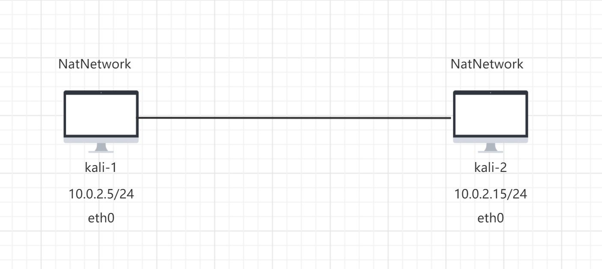


**网络连通性测试**


## 实验过程

**1.登录ssh**

```bash
#启动ssh服务
systemctl start ssh

#修改配置文件，允许root用户使用ssh登录
vim /etc/ssh/sshd_config
#修改内容
PermitRootLogin	yes		  

#重启ssh服务
systemctl restart ssh
```


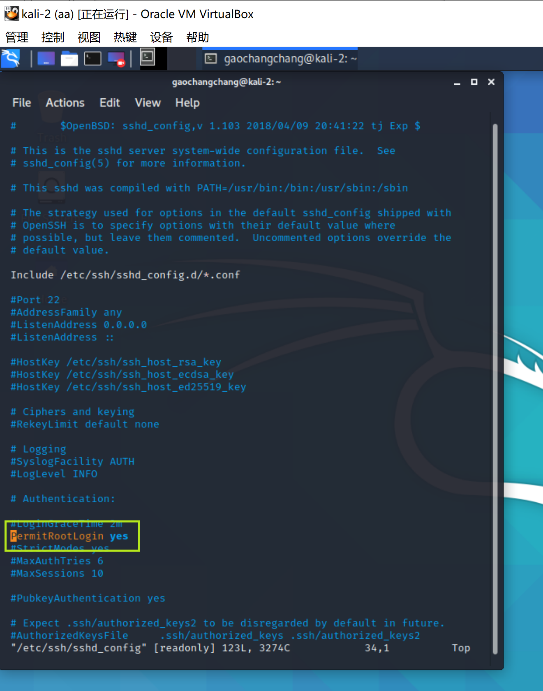

```bash
#远程登录
ssh root@10.0.2.15
```


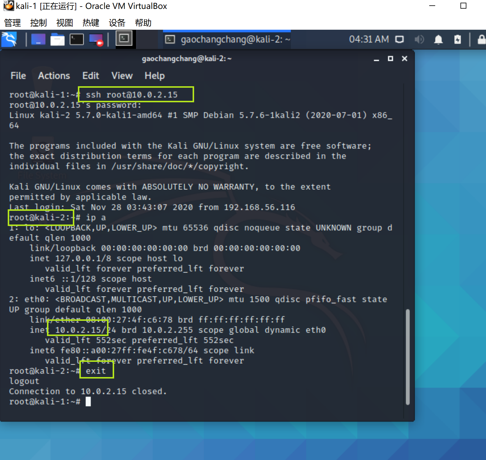

爆破ssh

```bash
#解压爆破字典
gzip -d /usr/share/wordlists/rockyou.txt.gz

#爆破工具hydra
hydra -l root -P /usr/share/wordlists/rockyou.txt -v 10.0.2.15 ssh
```


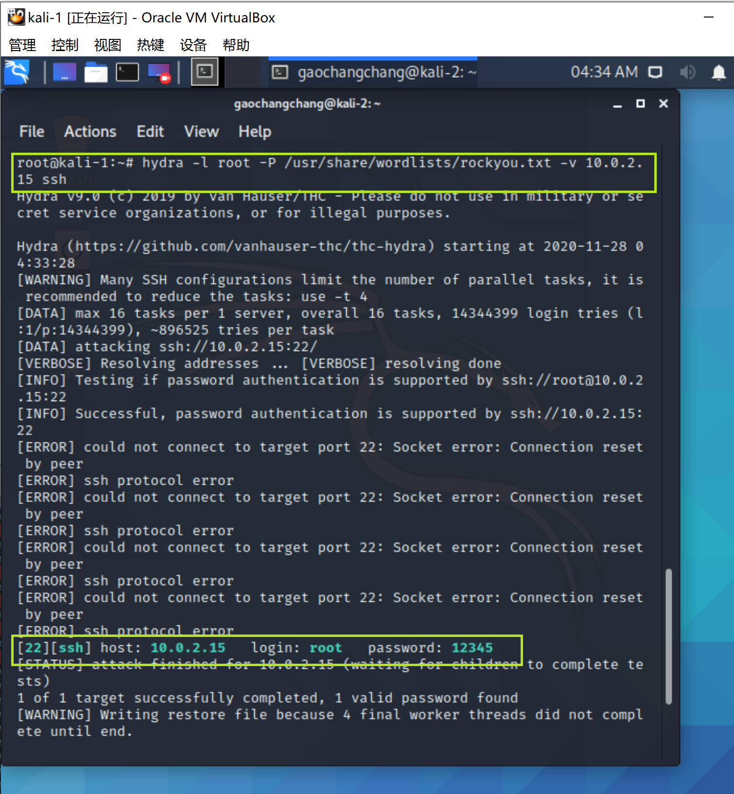


#### 2.练习使用fail2ban


```bash
#安装fail2ban
apt-get update && apt-get install fail2ban

#查看是否安装成功
fail2ban-client -h

#启动 fail2ban
fail2ban-client start
```

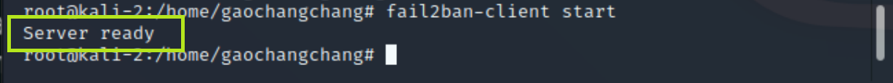

配置jail.local文件

```bash
 #在kali-2主机操作
 #备份
 cp /etc/fail2ban/fail2ban.conf /etc/fail2ban/jail.local
 
 #修改配置文件/etc/fail2ban/jail.local
 #添加如下内容
 [sshd]
 enabled = true
 
 #重启fail2ban
fail2ban-client restart
```

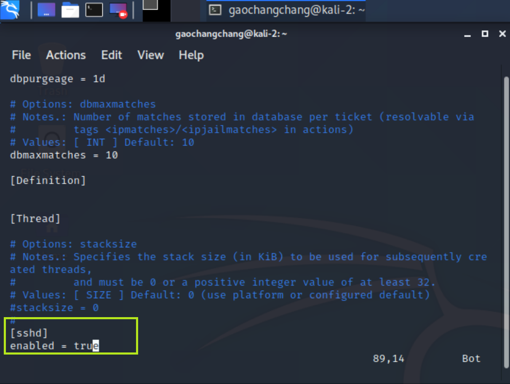

```bash
 #在kali-1主机操作
 #进行爆破
 hydra -l root -P /usr/share/wordlists/rockyou.txt -v 10.0.2.15 ssh
 
 #此时查看kali-2中fail2ban日志/var/log/auth.log
tail -f /var/log/auth.log
```

发现无法爆破密码，且无法通过ssh登录访问

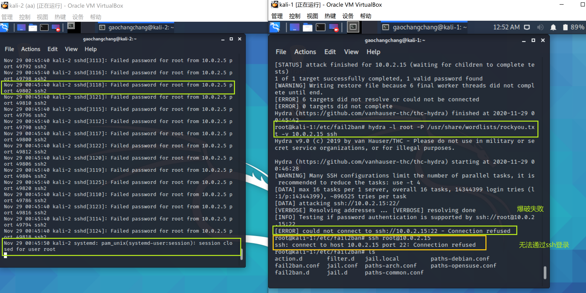

```bash
# 通过防火墙也可以查看到被禁止的ip
iptables -L -n
```


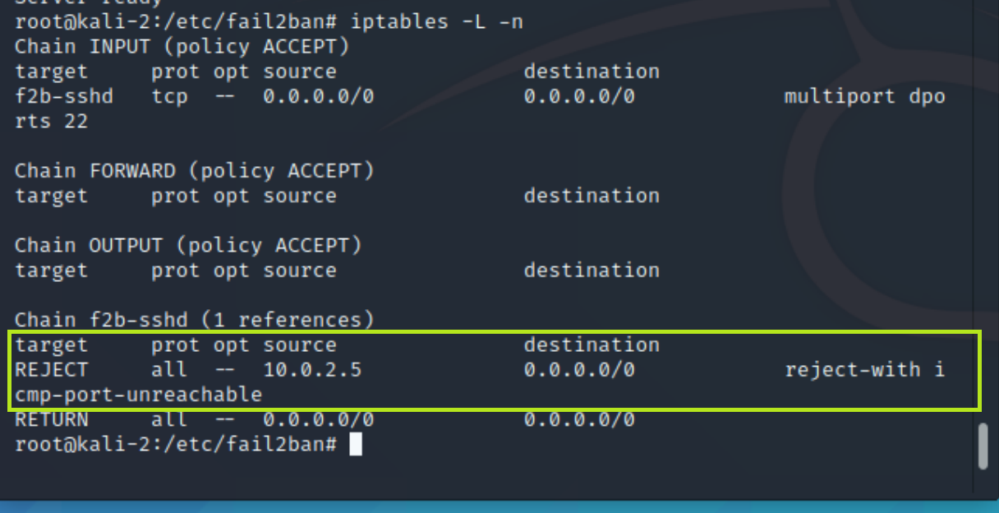

由于默认禁止时间是10min, 故10min后规则被清除

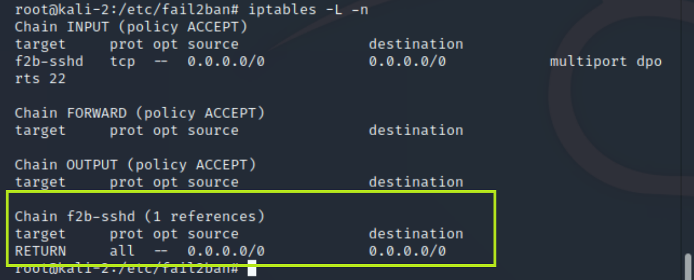

此时fail2ban会记录曾禁止过ip的数目，但是此时并不在Banned IP list上

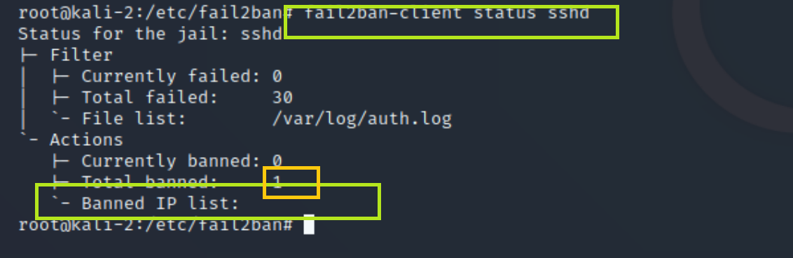


## 遇到的问题和解决方法

1.apt被占用

在安装fail2ban的时候，过程卡了好久，我就给停了，停了之后再执行安装命令就报错了（太没耐心了😅

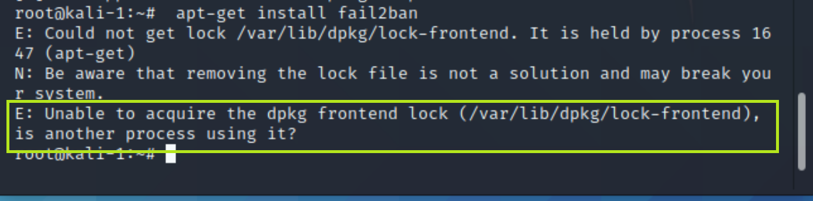

解决：

本来打算将apt-get进程结束就好，但是发现apt-get进程不能全部杀掉，故重启后执行`sudo dpkg --configure -a`

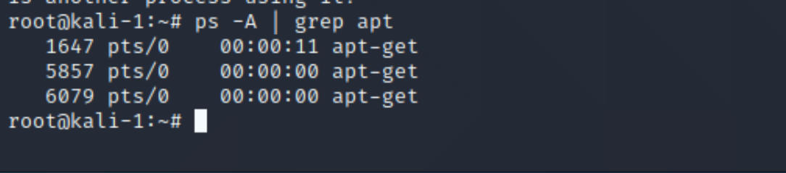


2.fail2ban无法启动


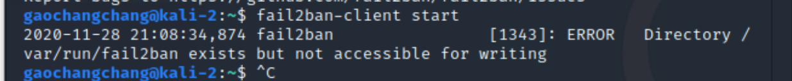


解决：`sudo su`再执行命令即可


## 参考文献

[how-to-show-all-banned-ip-with-fail2ban](https://serverfault.com/questions/841183/how-to-show-all-banned-ip-with-fail2ban)

[fail2ban-will-not-start](https://stackoverflow.com/questions/24451393/fail2ban-will-not-start)

[using-fail2ban-to-secure-your-server-a-tutorial](https://www.linode.com/docs/guides/using-fail2ban-to-secure-your-server-a-tutorial/)


