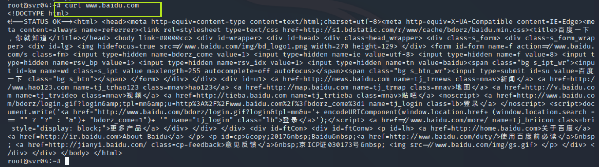

# 常见蜜罐体验和探索

## 实验目的

- 了解蜜罐的分类和基本原理
- 了解不同类型蜜罐的适用场合
- 掌握常见蜜罐的搭建和使用

## 实验要求

- [x] 记录蜜罐的详细搭建过程；
- [x] 使用 `nmap` 扫描搭建好的蜜罐并分析扫描结果，同时分析「 `nmap` 扫描期间」蜜罐上记录得到的信息；
- [x] 如何辨别当前目标是一个「蜜罐」？以自己搭建的蜜罐为例进行说明；
- [x] （可选）总结常见的蜜罐识别和检测方法；
- [x] （可选）尝试基于 [canarytokens](https://github.com/thinkst/canarytokens) 搭建蜜信实验环境进行自由探索型实验；


## 实验环境

- 从 [paralax/awesome-honeypots](https://github.com/paralax/awesome-honeypots) 中选择 1 种低交互蜜罐和 1 种中等交互蜜罐进行搭建实验
  - 低交互蜜罐
    - ssh-honeypot 0.1.0
  - 中等交互蜜罐
    - Cowrie 2.2.0
- Kali Rolling 2020.3
- docker 20.10.0


#### **网络拓扑**


#### **网络连通性测试**


## 实验过程

### 低交互蜜罐 ssh-honeypot


#### **1.选择原因**

- 可监听ssh连接时使用的IP地址，用户名和**密码**

- 支持docker安装

#### **2.搭建过程**

**安装docker**

```bash
#安装https协议、CA证书、dirmngr
apt-get update 
apt-get install -y apt-transport-https ca-certificates
apt-get install dirmngr

#添加GPG密钥并添加更新源
curl -fsSL https://mirrors.tuna.tsinghua.edu.cn/docker-ce/linux/debian/gpg | sudo apt-key add -
echo 'deb https://mirrors.tuna.tsinghua.edu.cn/docker-ce/linux/debian/ buster stable' | sudo tee /etc/apt/sources.list.d/docker.list

#系统更新以及安装docker
apt-get update
apt install docker-ce

#启动docker服务器
service docker start

#安装compose
apt install docker-compose

#docker安装测试(hello-world)
docker run hello-world
```


```bash
#查看docker版本
docker --version

#查看docker镜像
docker images

#列出容器
docker ps
```


**安装ssh**

```bash
#克隆仓库
git clone https://github.com/droberson/ssh-honeypot.git

#切换目录
cd ssh-honeypot

#构建运行环境
make

#生成公私钥对
ssh-keygen -t rsa -f ./ssh-honeypot.rsa
```


 **docker安装ssh-honeypot**

```bash
#切换文件夹
cd docker

#build
docker-compose build

#run
docker-compose -p ssh-honeypot up
```


#### 3.使用`nmap`扫描

```bash
#均无响应
nmap 10.0.2.15
nmap -sT -P 2222 -n -vv 10.0.2.15
nmap -sV -P 2222 -n -vv 10.0.2.15
nmap -sX -p 2222 -n -vv 10.0.2.15
nmap -sS -P 2222 -n -vv 10.0.2.15
nmap -sn -P 2222 -n -vv 10.0.2.15
```

此处截图不一一列举

发现`nmap`扫描无记录，果然是个低交互蜜罐...


#### 4.对蜜罐的辨别


先ssh登陆一波


不会吧不会吧，root和普通用户都连接不上😅但是攻击者的IP地址，用户名和密码可以全部显示👍


**总结**

ssh-honeypot是一个极简低交互蜜罐

Pros

- 可以查看攻击者ip,用户名及密码

Cons

- 无法登录建立连接（这不是让攻击者一秒识破吗..
- 功能太少

### 中等交互蜜罐 Cowrie

#### **1.选择原因**

- 安装过程极简单
- 有[官方文档](https://cowrie.readthedocs.io/en/latest/)，方便解决问题
- github一直在维护更新

#### **2.搭建过程**

```bash
#下载镜像
docker pull cowrie/cowrie

#运行镜像
docker run -p 2222:2222 cowrie/cowrie
```


#### 3.使用`nmap`扫描

```bash
#有响应
nmap -sT -P 2222 -n -vv 10.0.2.15
nmap -sV -P 2222 -n -vv 10.0.2.15

#无响应
nmap 10.0.2.15
nmap -sX -p 2222 -n -vv 10.0.2.15
nmap -sS -P 2222 -n -vv 10.0.2.15
nmap -sN -P 2222 -n -vv 10.0.2.15
```


此处对图片不进行一一列举，中等交互蜜罐确实比低交互蜜罐做得要完善一些

#### 4.对蜜罐的辨别

**ssh登录**


结果看来只有root用户可以登录，其他用户都无法登录


**常见命令测试**

```bash
#命令如下
ps aux
cat /etc/issue
lsb_release -a
ping www.baidu.com
```


其中，除了查看发行版本`lsb_release -a`露出破绽，其他看起来还都ok

中间有一次蜜罐自动断开了连接...可能是出于自我保护（破绽2


继续命令测试

```bash
#命令如下
curl www.baidu.com
wget http://www.cuc.edu.cn -O cuc.html
cat cuc.html
```




看起来curl指令是正常的，wget指令也有了破绽？😆（破绽3


试一试安装


查看python版本


试图修改文件


vi用不了，vim没有，我去查了查`terminal entry not found in terminfo`的报错，大概意思是/lib/terminfo 或 /usr/share/terminfo 目录下没有终端入口，但是安装了vim之后也很假（提问：这里的vi算破绽吗👀


尝试查看文件


只挂了个名，并没有实际的文件，真不错，这招名为“明修栈道,暗渡陈仓”，虚张声势罢了🤣


**查看日志文件**

这一系列行为都被记录在日志中

```bash
#查看docker id
docker ps

#将日志复制到本地查看
docker cp container_id:/cowrie/cowrie-git/var/log/cowrie ~

#进入文件夹
cd cowrie

#查看Log文件
cat cowrie.json | jq .
```


**总结**

Pros

- 功能很完备，ping, curl等指令显示无异常
- 有Tab的自动补全

Cons

- 每次重新登录root用户，无法上下翻动记录
- 一段时间会自动断开连接（~~这不是此地无银三百两吗..~~
- 无法编辑修改文件
- 假安装

### 常见的蜜罐识别和检测方法

- 常识和经验很重要（多尝试一些指令并注意观察细节）
- 重要信息被轻易的获取要小心可能是蜜罐，比如该站点有很多开放的端口，这些端口带有易受攻击的服务
- 目标是否有完善的信息流，如果没有经常的交互/登录等动态信息，这样的环境就很可疑
- 对网络特征进行识别，如网络流量、数据包内容、TCP/IP协议栈、网络延迟等
- 查看输出信息，是否有漏报或误报等破绽
- 使用现有的蜜罐检测工具，如[Checkpot](https://github.com/honeynet/checkpot)

### canarytokens蜜信实验

更改网络拓扑


网络连通性测试


**1.搭建过程**


```bash
#克隆仓库
git clone https://github.com/thinkst/canarytokens-docker

#切换文件夹
cd canarytokens-docker

#安装依赖包及docker-compose
sudo apt-get install python-pip python-dev
sudo pip install -U docker-compose
#if this breaks with PyYAML errors, install the libyaml development package
# sudo apt-get install libyaml-dev

#修改frontend.env配置文件
#修改内容如下
CANARY_DOMAINS=172.16.111.144
```


启动canarytokens


登录并创建一个URL token


攻击者访问生成的token


发现访问已被记录


查看记录发现攻击者的ip, 访问时间，访问用的浏览器等已被全部记录


暴露的彻彻底底🤣


通过ipip.net查询ip地址


## 遇到的问题和解决方法

1.在Cowrie实验中，ssh再次建立连接时登录报错


解决：将原来的公钥移除

执行`ssh-keygen -f "/root/.ssh/known_hosts" -R "[10.0.2.15]:2222"`即可


2.在canarytoken实验中，nginx无法启用，80端口被占用


解决：将apache卸载即可


3.在canarytoken实验中，攻击者访问特定URL后，防御方并没收到邮件？？👀

在主机上登录官网并生成了一个PDF token后，点击PDF是有邮件提示的...


邮件内容为


## 参考文献

[2019-NS-Public-chencwx](https://github.com/CUCCS/2019-NS-Public-chencwx/tree/ns_chap0x11/ns_chapter11)

[kali安装docker环境](https://zhuanlan.zhihu.com/p/82361096)

[第十一章视频](https://www.bilibili.com/video/BV1Nr4y1c7TT?from=search&seid=11542271424244158717)

[ssh-honeypot](https://github.com/droberson/ssh-honeypot)

[Terminal entry not found in terminfo](https://www.phpfans.net/ask/fansa1/5658918625.html)

[cowrie](https://github.com/cowrie/cowrie)

[canarytokens-docker](https://github.com/thinkst/canarytokens-docker)

[how-to-detect-a-honeypot](https://www.ethicalhacker.net/forums/topic/how-to-detect-a-honeypot/)

[如何判断是不是进入了蜜罐？](https://www.zhihu.com/question/31213254)

[基于蜜罐特征的蜜罐识别技术](https://kns.cnki.net/KXReader/Detail?TIMESTAMP=637434021328885000&DBCODE=CJFD&TABLEName=CJFD2009&FileName=XDDJ200915030&RESULT=1&SIGN=kSKoER6zYOH8aS8t4z90hufcKYw%3d)


