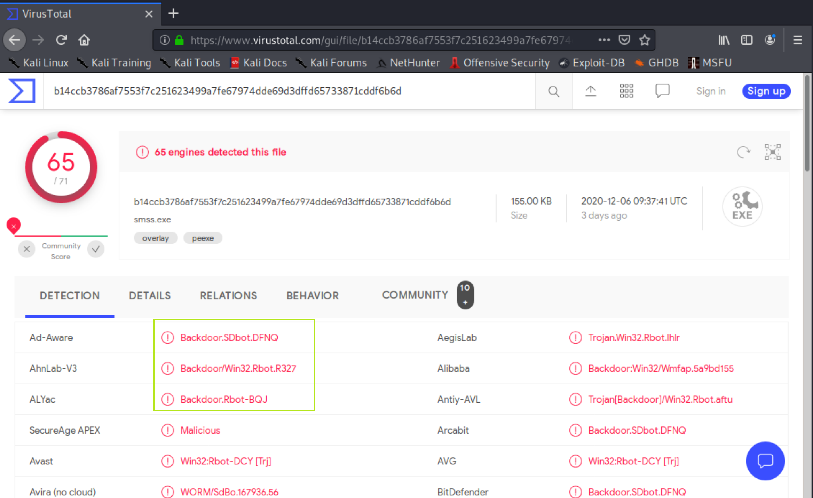

# 计算机取证

## 实验目的

- 了解计算机取证的基本原理和实现方法

## 实验要求

- [x] 使用zeek完成取证分析

## 实验环境


#### **网络拓扑**


#### **网络连通性测试**


## 实验过程

**安装zeek**

查看python版本


```bash
# 安装依赖
apt update && apt-get install cmake make gcc g++ flex bison libpcap-dev libssl-dev python-dev swig zlib1g-dev python-ipaddress

# 下载 zeek 源码包
wget https://download.zeek.org/zeek-3.0.11.tar.gz

# 解压缩 zeek 源码
tar zxf zeek-3.0.11.tar.gz

# 进入 zeek 源码解压缩后目录
cd zeek-3.0.11

# 生成构建脚本
./configure

# 构建成功后安装到构建脚本默认指定路径 /usr/local/zeek
make && make install
```


实验环境基本信息


### 编辑 zeek 配置文件

```bash
# 编辑 /usr/local/zeek/share/zeek/site/local.zeek ，在文件尾部追加两行新配置代码

@load frameworks/files/extract-all-files
@load mytuning.zeek
```


```bash
# 在 /usr/local/zeek/share/zeek/site 目录下创建新文件 mytuning.zeek ，内容为：
redef ignore_checksums = T;
```


###  使用 zeek 自动化分析 pcap 文件

```bash
# 下载课件中数据包
wget https://c4pr1c3.github.io/cuc-ns/chap0x12/attack-trace.pcap

# 开启自动化分析
zeek -r attack-trace.pcap /usr/local/zeek/share/zeek/site/local.zeek
```


解决上述警告信息，编辑 `mytuning.zeek` ，增加一行变量定义即可

```bash
# 增加内容
redef Site::local_nets = { 192.150.11.0/24 };
```

在 `attack-trace.pcap` 文件的当前目录下会生成一些 `.log` 文件和一个 `extract_files` 目录，在该目录下我们会发现有一个文件。


将该文件上传到 [virustotal](https://virustotal.com/) 我们会发现匹配了一个 历史扫描报告，报告显示是一个已知的后门程序




我们了解到该文件名的最右一个-右侧对应的字符串 `FHUsSu3rWdP07eRE4l` 是 `files.log` 中的文件唯一标识。

通过查看 `files.log` ，发现该文件提取自网络会话标识（ `zeek` 根据 IP 五元组计算出的一个会话唯一性散列值）为 `Cw7pv63MY6sYfZX6ml` 的 FTP 会话。


该 `Cw7pv63MY6sYfZX6ml` 会话标识在 `conn.log` 中可以找到对应的 IP 五元组信息。


通过 `conn.log` 的会话标识匹配，我们发现该PE文件来自于IPv4地址为：`98.114.205.102` 的主机。

### Zeek 的一些其他技巧

- `ftp.log`中默认不会显示捕获的 FTP 登录口令，可以通过在`/usr/local/zeek/share/zeek/site/mytuning.zeek`中增加以下变量重定义来实现：
  
  ```bash
  redef FTP::default_capture_password = T;
  ```
  
  

- 使用正确的分隔符进行过滤显示的重要性

  ```bash
  # 从头开始查看日志文件，显示前1行
  head -n1 conn.log
  
  # Bro的日志文件默认使用的分隔符显示为ASCII码\x09，通过以下命令可以查看该ASCII码对应的“可打印字符”
  echo -n -e '\x09' | hexdump -c
  
  # 使用awk打印给定日志文件的第N列数据
  awk -F '\t' '{print $3}' conn.log
  ```

  

- 查看Bro的超长行日志时的横向滚动技巧

  ```bash
  less -S conn.log
  ```

  

- 使用 `zeek-cut` 更“优雅”的查看日志中关注的数据列

  ```bash
  # 查看conn.log中所有可用的“列名”
  grep ^#fields conn.log | tr '\t' '\n'
  
  # 按照“列名”输出conn.log中我们关注的一些“列”
  zeek-cut ts id.orig_h id.orig_p id.resp_h id_resp_p proto < conn.log
  
  # 将UNIX时间戳格式转换成人类可读的时间（但该方法对于大日志文件处理性能非常低）
  zeek-cut -d < conn.log
  ```

  


## 遇到的问题和解决方法

学校内网实在无法访问


解决：通过官方网站下载

## 参考资料

[第十二章教材](https://c4pr1c3.github.io/cuc-ns/chap0x12/exp.html)